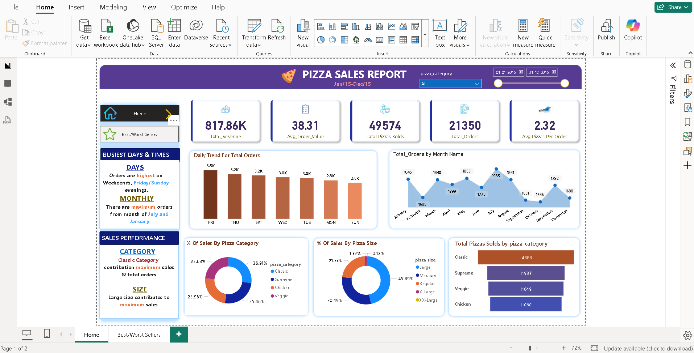
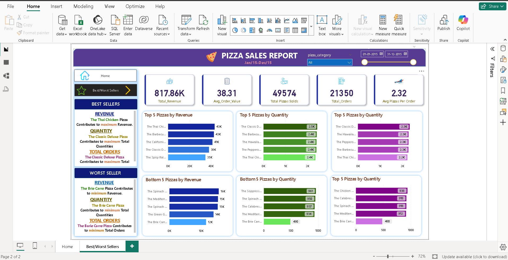

# 🍕 Pizza Sales Analysis — SQL + Power BI

## 📌 Project Overview
An end-to-end data analysis project on a pizza restaurant's sales data (Jan 2015 – Dec 2015).  
This project involves **SQL** for data extraction and KPI calculation, and **Power BI** for interactive dashboard creation.

---

## 🎯 Business Problem
A pizza restaurant wants to understand:
- How much revenue is being generated?
- Which days and months have the highest orders?
- Which pizza categories and sizes are most popular?
- Which pizzas are the best and worst sellers?

---

## 📊 Dashboard Pages

### Page 1 — Sales Overview

### Page 2 — Best & Worst Sellers

---

## 📈 Key KPIs

| Metric | Value |
|---|---|
| 💰 Total Revenue | $817.86K |
| 🧾 Average Order Value | $38.31 |
| 🍕 Total Pizzas Sold | 49,574 |
| 📦 Total Orders | 21,350 |
| 📊 Avg Pizzas Per Order | 2.32 |

---

## 🔍 Key Insights

- 📅 **Busiest Days** — Friday and Thursday have the highest order volumes
- 📆 **Peak Months** — July and January recorded maximum orders
- 🏆 **Best Selling Pizza** — The Thai Chicken Pizza (highest revenue)
- 📦 **Most Ordered Pizza** — The Classic Deluxe Pizza (highest quantity & orders)
- ❌ **Worst Seller** — The Brie Carre Pizza (lowest revenue, quantity & orders)
- 🍕 **Top Category** — Classic pizzas contribute 26.91% of total sales
- 📏 **Top Size** — Large size contributes maximum sales (45.89%)

---

## 🛠️ Tools & Technologies

| Tool | Usage |
|---|---|
| **MySQL** | Data cleaning, KPI queries, trend analysis |
| **Power BI** | Interactive dashboard, DAX measures |
| **Power Query** | Data transformation |
| **Excel/CSV** | Raw data source |

---

## 🗄️ SQL Queries Covered

- ✅ Total Revenue calculation
- ✅ Average Order Value
- ✅ Total Pizzas Sold & Total Orders
- ✅ Daily & Monthly order trends
- ✅ Data type conversion (STR_TO_DATE, ALTER TABLE)
- ✅ % of Sales by Category and Size
- ✅ Top 5 & Bottom 5 pizzas by Revenue, Quantity and Orders
- ✅ Safe update mode handling

---

## 📂 Project Files

| File | Description |
|---|---|
| `README.md` | Project documentation |
| `SQL_PIZZA_SALES.sql` | All SQL queries used in analysis |
| `pizza_sales.csv` | Raw dataset |
| `Pizza_Sales_Report.pdf` | Exported Power BI report |
| `screenshots/` | Dashboard screenshots |

---

## 💡 What I Learned

- Writing complex SQL queries with subqueries and aggregate functions
- Data type conversion and safe update practices in MySQL
- Building multi-page interactive dashboards in Power BI
- Using DAX for calculated KPI measures
- Deriving actionable business insights from raw sales data

---

## 📬 Connect With Me

